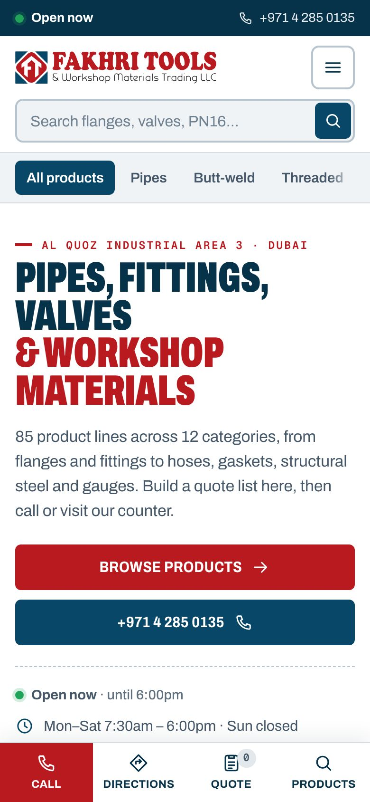
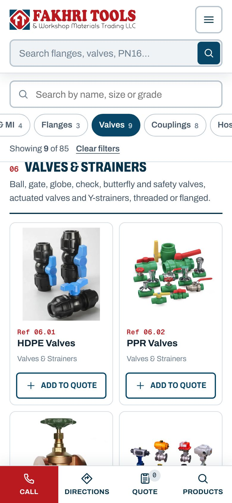
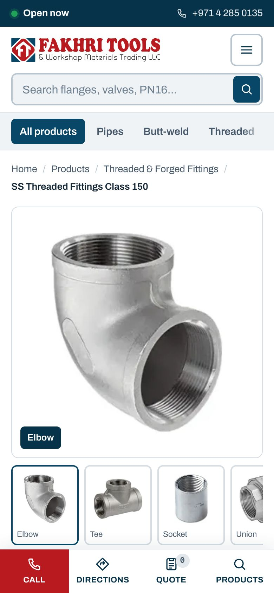
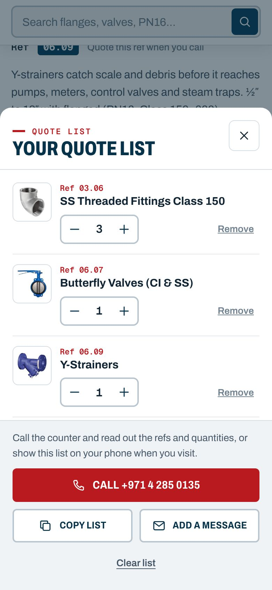
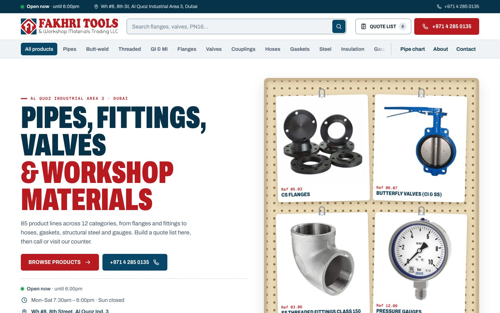

# Fakhri Tools & Workshop Materials Trading LLC: website

A phone-first catalogue site for the Fakhri Tools trade counter in Al Quoz Industrial Area 3, Dubai. It is built to feel like a hardware store, not a software product: white shelves, a big search bar, category aisles, a ref number on every product, and a quote list you can read out over the phone.

| Phone | | | |
|---|---|---|---|
|  |  |  |  |



## Shop details used on the site

| | |
|---|---|
| Name | Fakhri Tools & Workshop Materials Trading LLC |
| Address | Wh #8, 8th Street, Al Quoz Industrial Area 3, Al Quoz, Dubai, UAE |
| Phone | +971 4 285 0135 |
| Hours | Monday to Saturday 7:30am to 6:00pm, Sunday closed |

All of these live in one place, `SITE` in `tools/build-data.py`. `SITE.url` is the site's public address (canonical links, sitemap and structured data use it; change it when the shop gets its own domain) and `SITE.ga4` turns on Google Analytics. Search changes are recorded in [`docs/seo-log.md`](docs/seo-log.md). The site shows a live **Open now / Closed** badge, a "today" marker in the hours table and the current Dubai time (GST, UTC+4), so it is correct for visitors in any time zone.

## What changed from the AQM prototype

- **Rebrand.** Every AQM name, logo, team photo, partner logo, industry page and download is gone. The Fakhri Tools logo was traced from the supplied JPG into crisp SVGs (`tools/vectorize-logo.py`): a horizontal lockup for the header, a white version for the footer, the stacked logo, the emblem, and favicons.
- **Hardware look instead of SaaS.** The site is now light, with the logo's red `#b91a20` and navy `#084767`, condensed uppercase headings and a dense product grid. The home page has a pegboard of products hanging on hooks and a tape-measure strip. The dark 3D hero, globe and smooth-scroll library are gone. The page JS is now 28 KB of plain JavaScript (no GSAP, Lenis or Three.js).
- **Phone first.**
  - A fixed bottom bar with Call, Directions, Quote and Products.
  - The search bar stays pinned while the logo row slides away on scroll.
  - On the catalogue page, the category chips and catalogue search stick under the header.
  - Tap targets are at least 44px and there is no sideways scrolling at 320px.
  - On phones, the map zooms in on the shop.
- **Ordering flow that fits a trade counter.** There is no checkout:
  1. Customers tap **Add to quote** on any product and set quantities.
  2. They then either call and read out the ref numbers, show the list at the counter, or copy it.
  3. The contact form turns their details plus the quote list into a ready-to-send enquiry. Nothing is sent to a server.
- **Errors fixed.**
  - Product pages with many range photos (for example the 9-item Class 150 fittings range) stretched the page sideways on phones; fixed.
  - The phone header no longer jitters while scrolling.
  - The "Added" message no longer covers the open quote list.
  - All 91 pages have been checked for broken links, console errors and sideways scrolling.

## Products: what was taken from mabrook-uae.com

The brief was "take the products from mabrook-uae.com; if they are already there, don't do anything". The existing catalogue had 75 product lines, and a Mabrook item counts as already there when an existing line covers the same material and product type. mabrook-uae.com blocks automated access (BitNinja captcha), so the product pages were read from the Internet Archive's 22 June 2024 snapshots, and the photos were fetched directly from Mabrook.

**10 new lines added** (marked with their category ref):

| Ref | New line | From Mabrook |
|---|---|---|
| 01.11 | SS Decorative & Structural Tubes | Structural steel: SS Tubes |
| 03.06 | SS Threaded Fittings Class 150 | 9 items: elbow, tee, socket, union, hex nipple, cap, plug, reducer bush, reducer socket (all 9 photos in the gallery) |
| 03.07 | Long Barrel Nipples (GI, SS & MS) | Barrel nipples: GI, SS, MS |
| 06.07 | Butterfly Valves (CI & SS) | Valves: CI and SS butterfly valves |
| 06.08 | Safety Valves | Valves: safety valves |
| 06.09 | Y-Strainers | Valves: CI Y-strainers |
| 09.06 | Spiral Wound Gaskets | Gaskets: spiral wound |
| 10.05 | SS Angles, Channels & Flat Bars | Structural steel: SS channels |
| 10.06 | SS Round Bars | Structural steel: SS round bars |
| 10.07 | GI Sheets | Structural steel: GI sheets |

**Already covered, so left alone:**

| Mabrook item | Existing line |
|---|---|
| Carbon steel pipes | CS/MS Seamless & Welded Pipes |
| Galvanized steel pipes | GI Pipes |
| Stainless steel pipes (YCInox) | SS Seamless, ERW, EFW, LSAW & HFW Pipes |
| MS butt-weld fittings | CS Butt-Welded Seamless Fittings |
| SS butt-weld fittings | SS Butt-Welded Seamless and ERW Fittings |
| MS flanges | CS Flanges |
| SS flanges | SS Flanges |
| GI threaded fittings | GI Threaded Fittings |
| MI threaded fittings | MI Fittings |
| MS 1000 PSI fittings | Low Pressure 1000 PSI Fittings |
| MS 3000 PSI fittings | High Pressure 2000, 3000 & 6000 PSI Fittings |
| Camlock couplers and adapters (parts A to F, DC, DP) | the four camlock lines |
| Grooved fittings | Grooved Firefighting Couplings |
| Expansion joints and flexible connectors | Universal Assembly & Flexible Joints, Rubber Flexible Connector |
| Rubber, green and red gaskets | the cut gasket and sheet lines |
| Ball, check, gate and globe valves | Flange End Valves, Threaded & Socket-Welded Valves |
| MS channels and beams | Universal Beams & Channels |
| Pressure gauges | Pressure Gauges |

Not added: **Black Metallic Gaskets** (unclear whether it means ring-type joints or spiral wound; easy to add once confirmed). Mabrook's "Machines", "Industry solutions" and "Our brands" pages are company content rather than products.

The catalogue is now 85 lines in 12 categories. New photos have Mabrook's grey caption bar cropped off and are padded to a square on white.

## Please check before going live

1. **Email and WhatsApp.** None were supplied, so the quote list and enquiry form offer **Call** and **Copy**. Add `email` and/or `whatsapp` (digits only, for example `971501234567`) to `SITE` in `tools/build-data.py` and rebuild: **Email list** and **Send on WhatsApp** buttons then appear automatically.
2. **Map pin.** The pin is placed at Al Quoz Industrial Area 3 from the address, not from GPS. The **Get directions** button searches Google Maps for the shop name. If you have a Google Maps share link for the warehouse, put it in `SITE.maps`.
3. **Product text and photos.** The original 75 lines still use the descriptions and photos from the earlier prototype (sourced from aqmoilfield.com). They read as generic catalogue copy, but replace any photo or claim that doesn't match what Fakhri Tools stocks.
4. **Brands and group.** Mabrook lists brands (Welham Mass, Bossini, Bothwell, Froch, YCInox, Jazeera, SA Brand, TA Chen, Surya) and says it is part of Fakhri Group. Neither is claimed on this site. Say the word if they should be.
5. **Legal page.** Terms, privacy and cookie sections are placeholders.

## Pages

| Page | What it does |
|---|---|
| `index.html` | Pegboard hero, 12 category aisles, featured products, how ordering works, pipe chart teaser, visit block with live hours and map |
| `products.html` | All 85 lines grouped by category. Sticky chip filters on phones and a sidebar on desktop, instant search, deep links such as `products.html#valves` |
| `products/<slug>.html` | 85 product pages. Each has a photo gallery with zoom, a specs table, quantity and Add to quote, a call box, related items, and previous/next links |
| `pipe-chart.html` | Interactive pipe schedule explorer (½″ to 24″, SCH 40 / 80 / 160 / XXS) plus the full table |
| `contact.html` | Call, visit and hours cards, an enquiry builder that attaches the quote list, and the map |
| `about.html` | About the shop, the full range, ordering steps, visit block |
| `legal.html` | Placeholders |

## Run it

```bash
npm install
npm run build   # CSS, JS, all pages, sitemap.xml and robots.txt
NOINDEX=1 npm run build   # same, but every page tells Google not to index it (for preview copies)
npm run serve   # http://localhost:5173
```

The built site is plain static files and also works when opened straight from disk (`index.html`).

To rebuild the catalogue from source (needs Python 3 with Pillow, numpy, scipy and potracer):

```bash
npm run fetch:source   # Mabrook photos and map data into .cache/source
npm run build:logo     # trace the logo into SVGs
npm run build:images   # crop and square product photos, build category tiles
npm run build:data     # write src/data.js from tools/catalogue/*.json
npm run build
```

- Catalogue sources:
  - `tools/catalogue/base.json`: the 75 original lines
  - `tools/catalogue/additions.json`: the 10 Mabrook lines, with specs and gallery items
  - `tools/catalogue/categories.json`: names, order and blurbs
- Page templates are in `src/templates/`.
- Styles are in `src/css/`: `base.css` covers tokens, header, footer, drawer and the bottom bar; `components.css` covers cards and blocks; `pages.css` covers page layouts.
- Browser code is in `src/js/`.
