# Nocturne — a redesign prototype for AQM Oilfield

A cinematic, fully-working prototype of a new website for **AQM Oilfield Equipments Trading F.Z.C** (Ajman Free Zone, UAE), built from a full audit of [aqmoilfield.com](https://aqmoilfield.com). Every page, product, document and piece of copy on the live site is carried over, and the site is rebuilt around one idea.

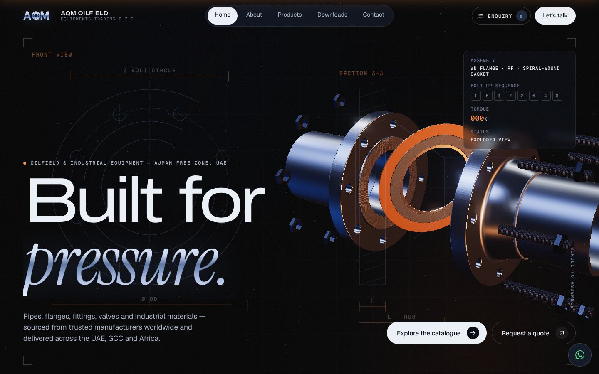

## The idea

**The Q in AQM is a flange.** The original logo draws its Q as a flange ring with bolt holes. A flange *joins things under pressure*, and that is also what AQM does as a business: it connects manufacturers in seven countries to projects across the UAE, GCC and Africa.

So the site opens on a weld-neck flange joint, rendered live in 3D. As you scroll it assembles: the flanges close on a spiral-wound gasket, eight studs slide through, and the nuts run down in the real **1-5-3-7-2-6-4-8 star torque sequence**, each flashing amber as it seats. The HUD tracks the bolt-up. Then the camera swings onto the axis and flies down the bore, *into the line* and into the rest of the site.

**Nocturne** is the visual mood: oil & gas at blue hour. The palette pairs night navy and the brushed chrome of AQM's logo with one warm accent, the amber of refinery light. The reference is the live site's own photography, which is blue-hour industrial with a sodium-orange glow.

| | |
|---|---|
| 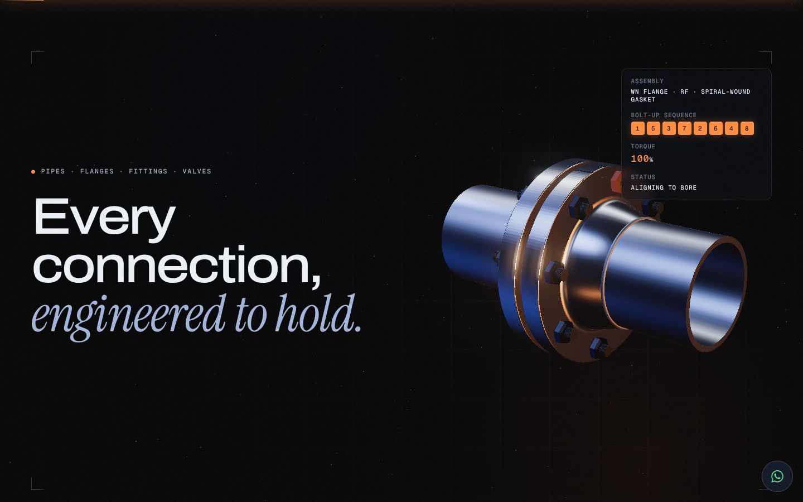 | 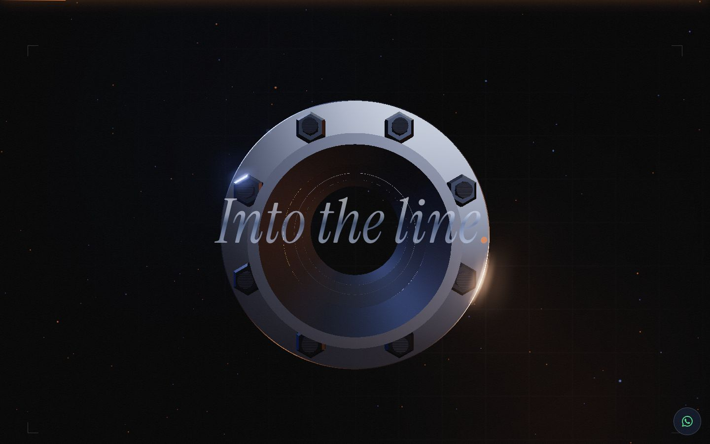 |
| 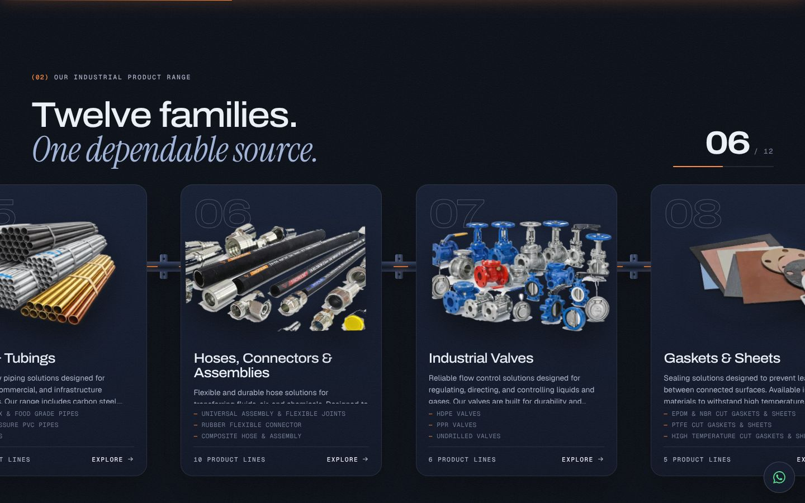 | 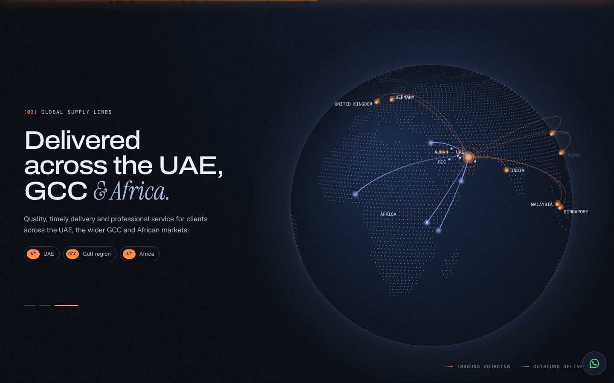 |
| 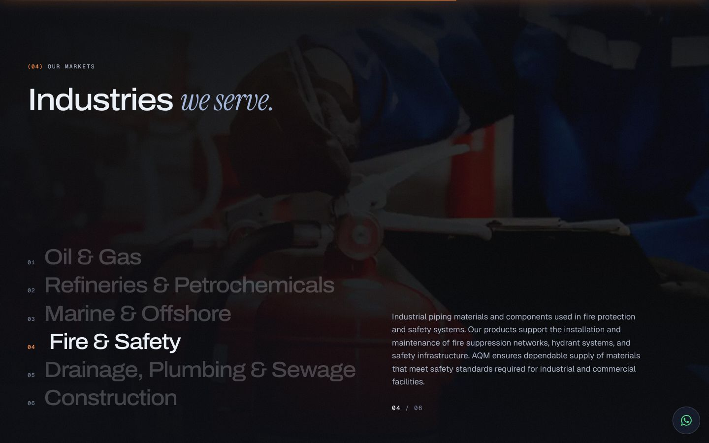 | 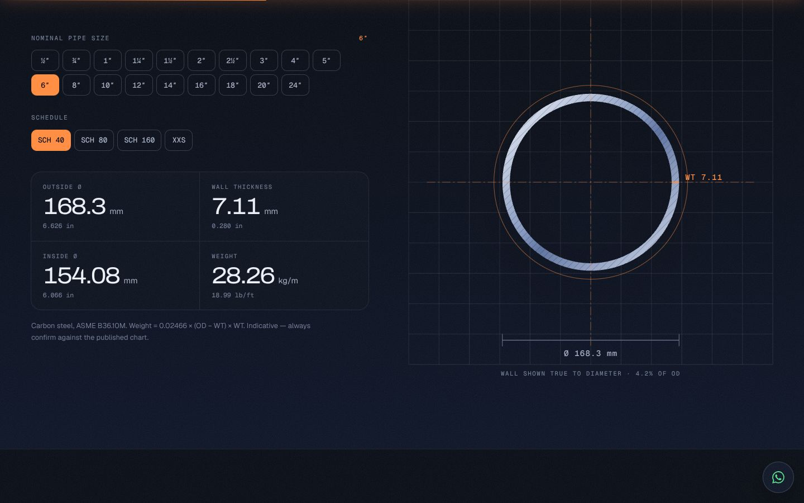 |
| 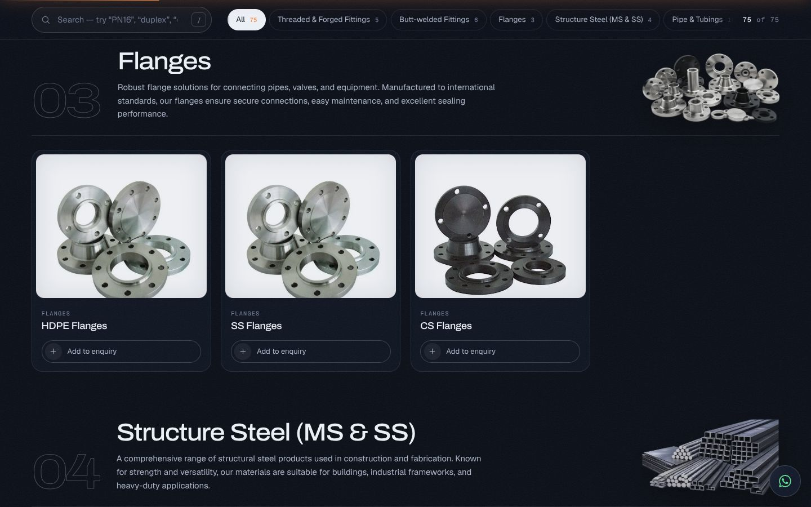 | 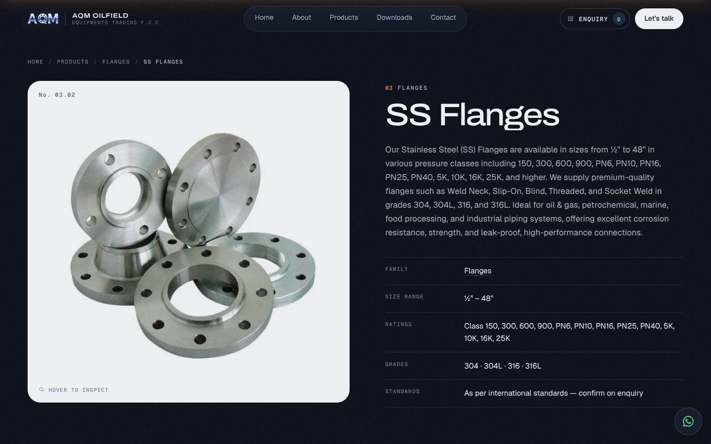 |
| 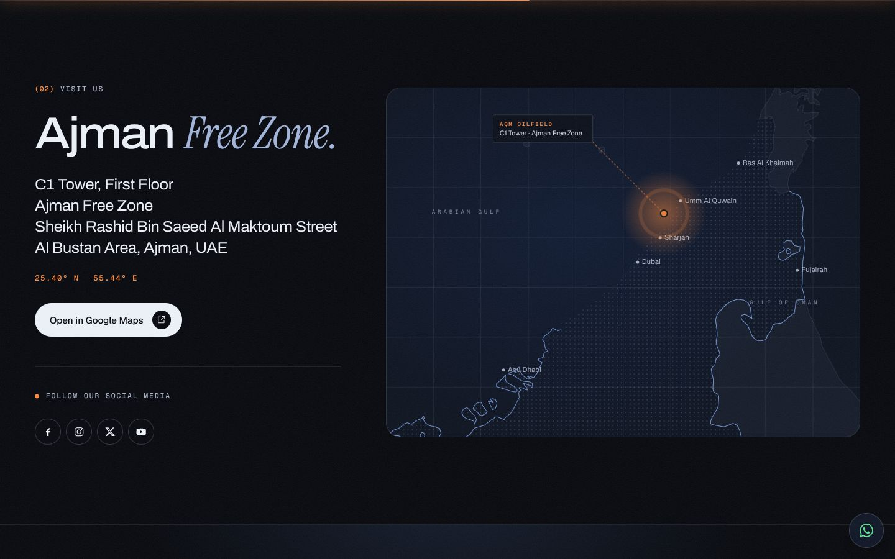 | 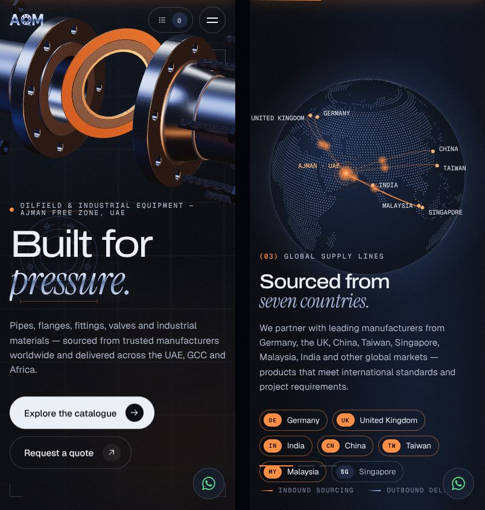 |

## Signature moments

| Moment | What it does |
|---|---|
| **Pressure-gauge preloader** | A 0–100 bar gauge sweeps to full scale with a needle overshoot. Shown once per session. |
| **Flange-joint hero** | A procedural Three.js weld-neck joint: machined serrations on the raised face, a spiral-wound gasket, threaded studs, heavy-hex nuts. It assembles on scroll, then the camera dollies through the bore. An engineering drawing (front view, section A–A, dimension lines) sketches itself over it. |
| **Gate-valve page transitions** | Two gates close over the page with an amber seam and the AQM mark, then open on the next page. |
| **The range as a pipeline** | The 12 product families scroll sideways on a live pipe with flange joints between cards. Category renders float on the night palette, with parallax inside each card. |
| **Night-globe supply lines** | 4,500 land dots (Natural Earth data). Amber arcs run in from Germany, the UK, India, China, Taiwan, Malaysia and Singapore to Ajman, then blue arcs run out to the GCC and Africa. The camera moves with the copy. |
| **Industries** | Six sectors, one scroll step each, with full-bleed photography crossfading. |
| **Engineer's desk** | An interactive **pipe-schedule explorer** (NPS ½″–24″, SCH 40/80/160/XXS) with a live cross-section, OD/WT/ID and kg/m. |
| **Enquiry (RFQ) builder** | Add products from anywhere and set quantities. The list goes out as a single **email, WhatsApp message or form** with everything pre-filled. |
| **Live office status** | "Open now · closes 6:30 PM", computed in Ajman time (GST, UTC+4), plus a local clock and today highlighted in the hours table. |
| **Custom UAE map** | A coastline drawn from Natural Earth data, with the Ajman Free Zone pin pulsing. |
| **Logo wall** | 16 partner logos normalised into white silhouettes. On hover, each reveals its true colours on its native ground. |

## Coverage: everything on the live site, and where it went

| Live site | Prototype |
|---|---|
| Home hero: "Trusted Supplier of Oilfield & Industrial Equipment in UAE", intro, *View Products* / *Contact Us* | Home → hero ("Built for pressure."), lead and both CTAs. The original phrase is kept in the page title/description for SEO. |
| Who we are | Home (01) word-by-word scroll reveal, plus figures |
| 12 product-range cards | Home (02) pipeline, and a category header on each catalogue group |
| Reliable Industrial Supply Partner + 16 logos | Home (06) / About (09): marquee and logo wall |
| Industries We Serve (6) | Home (04) pinned sequence |
| Let's start talking (form) | Home (08), Contact (01) |
| Why Choose AQM (4 pillars) + tagline | Home (05) cards and the pledge quote |
| About: Introduction & About text | About (01) |
| About: sourcing countries, markets | About (02) supply-flow diagram, Home (03) globe |
| About: sectors list | About (03) |
| About: Objectives, Vision, Mission, Values | About (04)–(07) |
| About: team (4) | About (08) |
| Products: 75 products over 5 paginated pages | One filterable, searchable catalogue + **75 static product pages** with related items, prev/next and technical documents |
| Downloads: brochure + 27 charts (PDF viewers that fail to load on the live site) | Technical library: featured 3D brochure, filterable index of all 28 PDFs (linked to the live files), schedule explorer |
| Contact: phone, email, address, socials, hours, form | Contact: four channel cards, form + hours, map |
| Footer: about, products, contact, address, hours, legal | Footer: all of it, plus live status, Ajman clock and back-to-top |
| WhatsApp button | Floating WhatsApp button (+ WhatsApp actions throughout) |

## Things I fixed or flagged on the live site

- **Downloads are broken.** All 28 embedded PDF viewers show "Error loading PDF". The prototype links straight to the files.
- **A dead link on every page.** The footer's "Threaded Fittings" points to `/product-category/threaded-fittings/`, which returns 404. The category is `threaded-forged-fittings`.
- **Typos in product and category names**, corrected: *Needal → Needle*, *Vaccum → Vacuum*, *Baurer → Bauer*, *Threaed → Threaded*, *Socked-welded → Socket-welded*, *Vavles → Valves*, *Seawage → Sewage*, *olifield / Ollfield / certifiod*.
- **Counters not carried over.** About animates to *14K+ happy clients, 21K+ projects, 471+ expert team, 4.8 rating*. These look like theme defaults (the page shows a team of four), so the prototype uses verifiable figures instead: 12 families, 75+ lines, 16 partners, 7 sourcing countries, 3 regions.
- **Social icons have no URLs** and **legal footer items have no pages.** The prototype has placeholders (`legal.html`) for AQM to fill.

## Open questions for AQM

1. **Real counters?** If AQM has genuine client and project numbers, they slot into the figures rows.
2. **Photography.** The two About images are AI-generated (`Gemini_Generated_Image_*` on the live site). Real yard and office photos would strengthen trust.
3. **Social profile URLs** and **legal text** (terms, trademark, cookies, privacy).
4. **Form backend.** In the prototype the form validates, then prepares the message for email or WhatsApp. At launch, point `[data-form]` at a real endpoint (or the existing Elementor/WordPress handler).
5. **Logo.** The header uses a vector redraw of the AQM monogram (flange-Q, chrome gradient). The original raster logo still appears on the brochure cover. Confirm, or supply a vector master.
6. **HDPE Flanges** reuses the SS Flanges photo on the live site, so it does here too.

## Run it

```bash
npm install
npm run dev          # builds, then serves on http://localhost:5173
```

The built site is committed, so you can also just open `index.html`. Everything works from `file://`: scripts are bundled as classic IIFEs and fonts are inlined.

```
index.html  about.html  products.html  downloads.html  contact.html  legal.html
products/<slug>.html        75 generated product pages
assets/css|js|img           built output (committed)
src/templates/*.js          page templates (rendered to static HTML at build time)
src/js/*                    client: smooth scroll, motion, transitions, RFQ, globe, page logic
src/hero.js                 the Three.js flange joint
src/css/*.css               design system: tokens, chrome, home, pages
src/data.js                 generated content (catalogue, partners, downloads, globe dots, UAE map, pipe data)
tools/                      fetch → process images → build data → build pages
```

**Rebuild from the live site** (needs Python 3 with Pillow, numpy and scipy):

```bash
npm run fetch:source    # catalogue via the WooCommerce Store API, imagery, Natural Earth data → .cache/
npm run build:images    # cut-outs, logo silhouettes, webp encoding → assets/img
npm run build:data      # → src/data.js
npm run build           # CSS + JS + 81 static pages
```

## Craft notes

- **Static and fast.** No framework. Pages are pre-rendered for SEO and work without JS. Client JS only adds motion and behaviour, and the 3D bundle loads on the home page only.
- **Motion**: GSAP + ScrollTrigger + SplitText, with Lenis smooth scroll. Hero and globe progress use time-based easing with a capped lag, so they never trail the copy.
- **Adaptive 3D**: bloom and resolution drop automatically on slow devices, and rendering pauses when the hero is off-screen or the tab is hidden. If WebGL is unavailable, a still render is shown instead.
- **Accessible**: skip link, focus styles, ARIA on menus, drawer and toolbars, keyboard `/` to search, Escape closes overlays. `prefers-reduced-motion` freezes the hero on the assembled joint, removes pinning and scrubbing, and shows all content immediately.
- **Typography**: Archivo (variable width; expanded for display), Instrument Serif italic, Geist, Geist Mono. All are SIL OFL and self-hosted.
- **Credits**: three.js (MIT), GSAP (free "no charge" license), Lenis (MIT), Natural Earth via world-atlas (public domain). Product, team, partner and site imagery belongs to AQM Oilfield and the respective manufacturers.
